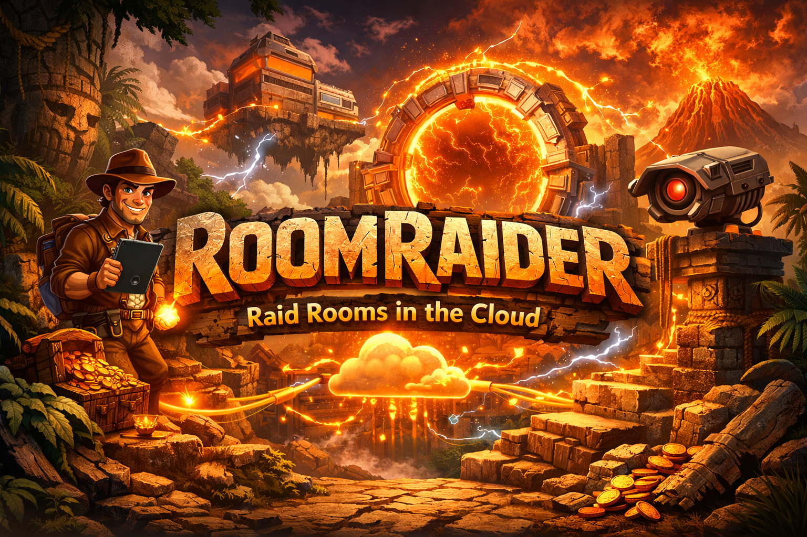
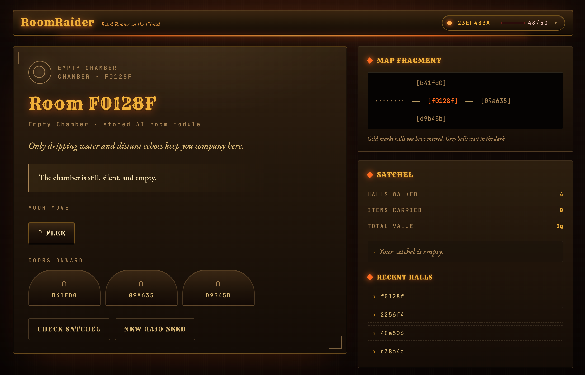
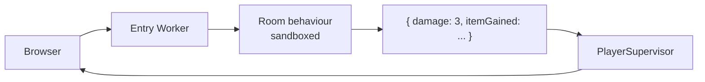
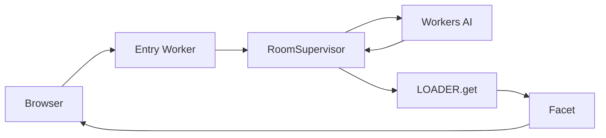
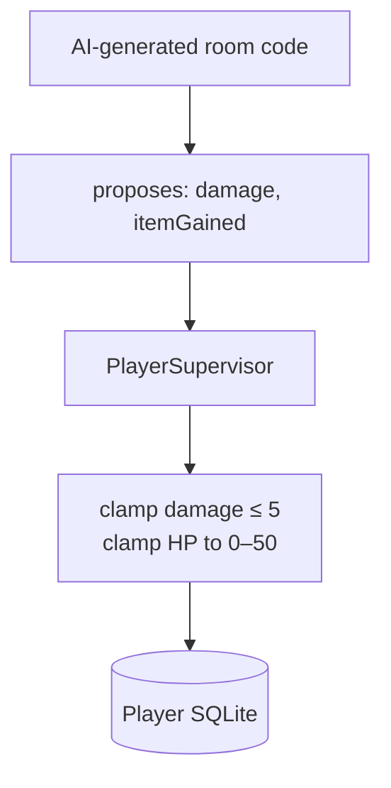

<p align="center">
  
</p>

<h1 align="center">RoomRaider</h1>

<p align="center">
  <em>A small dungeon-crawler game built to explain four Cloudflare features by using them.</em>
</p>

<p align="center">
  <a href="https://github.com/boyney123/cloudflare-room-raiders">github.com/boyney123/cloudflare-room-raiders</a>
</p>

---

## What is this?


RoomRaider is a tiny multiplayer dungeon. You walk into a room, decide whether to grab the treasure, fight the monster, or run. The catch: every room is **shared**. If another raider got there first and took the loot, you find an empty pedestal. If they slew the monster, you walk into a quiet room.

But your **inventory** and your **health** are yours alone.



The whole point of the project is to show how four pieces of Cloudflare fit together to make that work — without letting the dynamic, AI-generated room code touch your wallet.

If you've never used Cloudflare before, this README is for you. It walks through what's happening and why each piece is there.

## Try it

```bash
npm install
npm run cf-typegen
npm run dev
```

Open the URL Wrangler prints. Click **Begin the Raid**. To see the multiplayer thing in action: click your raider in the top-right and pick **Open as New Raider** — that opens a second tab as a different player. Walk both tabs into the same room ID and notice that whoever takes the treasure first wins.

## The four Cloudflare pieces

This project uses four Cloudflare features. Here's the one-line version of each, then we'll see how they combine.

### 1. Workers

A **Worker** is just a function that runs on Cloudflare's edge in response to HTTP requests. Think of it like an Express handler that runs everywhere in the world. There's one entry Worker in this project (`src/index.ts`) — it serves the HTML and the JSON API.

### 2. Durable Objects

A regular Worker has no memory between requests. A **Durable Object** is a Worker that *does* — it has its own private SQLite database that survives across requests. You address one by name (`idFromName("alice")`), and Cloudflare guarantees there's exactly one instance of it running anywhere in the world for that name. Perfect for "the data that belongs to user Alice" or "the state of room ABC123".

This project has three Durable Object classes:
- **PlayerSupervisor** — one per raider. Holds your inventory, HP, and visited rooms.
- **RoomSupervisor** — one per room ID. Holds the room's definition (title, monster, treasure) and shared progression (has the treasure been taken? is the monster dead?).
- **AppRunner** — one per room ID. Loads the room's behavior code and runs it.

### 3. Workers AI

Cloudflare runs LLMs you can call from a Worker via `env.AI.run("model-name", { prompt })`. We use it to generate each room the first time anyone enters it — title, flavour text, monster, treasure, difficulty checks, all of it. The result gets cached forever in the room's Durable Object, so the AI is only called once per room.

### 4. Dynamic Workers + Durable Object Facets

This is the unusual one. Most Workers are static — you write them, deploy them, they run.

**Dynamic Workers** lets one Worker *load other Workers at runtime* from a string of source code. We use it like this: when the AI generates a room, we compile the room's behavior into a JavaScript module string and store it. Later, when someone enters that room, we hand the stored source to `LOADER.get(codeId, source)` and it returns a fresh sandboxed Worker class.

**Durable Object Facets** are like sub-Durable-Objects. From inside one parent DO, you can attach multiple isolated facets, each with its own storage and its own loaded class. We give each `(room, raider)` pair its own facet — same loaded room code, different KV storage. So two raiders in the same room run the same code but each has private per-room state (visit count, items lost there, "did I already fail to take the treasure" lockout).

This combination is the trick that makes the whole project work. The dynamic, AI-generated code runs in a sandbox that can't reach your inventory.

## How a single request works

Here's what happens when you click "Take the treasure":



1. Browser POSTs to the entry Worker.
2. Worker asks the room's facet to run its `take` action.
3. The facet rolls a d20, decides what happened, and returns a *delta* — "you gained an item", "you took 3 damage". It does NOT write to your inventory itself.
4. The Worker passes the delta to **PlayerSupervisor**, which is trusted code. It clamps the damage (max 5 per hit), updates HP, adds the item.
5. New player state goes back to the browser.

The room code never touches the player database. It can ask for things; trusted code decides whether to listen.

## How a brand-new room gets created

The first time anyone walks into a room ID, a few extra things happen:



1. Worker asks RoomSupervisor for the room.
2. RoomSupervisor sees it doesn't exist yet. It calls Workers AI with a JSON-schema prompt asking for a room: title, item, monster, difficulty checks, flavour text.
3. The AI response gets *normalized* by trusted code — DCs clamped to 5–18, max damage clamped to 5, etc. Then it's compiled into a JavaScript module string and stored in the Durable Object's SQLite forever.
4. `LOADER.get(codeId, source)` loads that module as a Worker class.
5. A facet is attached for `(room, raider)`. The room runs its `enter()` action.
6. Result goes back to the browser.

Subsequent visits skip the AI call — the stored module gets loaded straight from cache.

## The trust boundary

This is the most important idea in the project, so it's worth its own diagram.

There are four places data lives:

| Storage | Who writes it | What's in it |
|---|---|---|
| **PlayerSupervisor SQLite** | Trusted code only | Your inventory, HP, visited rooms |
| **RoomSupervisor SQLite** | Trusted code only | Room definition, shared progression |
| **Facet KV** | The sandboxed room code | Per-(room, raider) visit history |
| **Worker Loader cache** | Cloudflare runtime | The loaded module itself |

The AI-generated room code only has access to its own facet's KV. It can roll dice, mutate that KV, and *suggest* deltas like "deal 9999 damage". The supervisor receiving that delta decides what to actually apply — and it caps damage at 5 no matter what the room asked for.



If you only remember one thing from this project: **the AI writes content, trusted code enforces rules.**

## The game itself

A few rules, mostly so you can read the code without surprise:

- You start with **50 HP**. Max damage per hit is **5**, regardless of what the room rolls for.
- Every action that matters rolls a **d20** vs. a **DC** (difficulty check) the AI picked at room-creation time. DCs are clamped to 5–18.
- **Take treasure** → roll vs. takeDC. Fail and the treasure locks you out of this room forever.
- **Fight a monster** → roll vs. fightDC. Fail and you take 1–5 damage, but you can try again. Win and the monster's loot becomes available.
- **Cursed treasure** (the AI marks ~25% of items as cursed) → after taking it, roll vs. curseDC. Fail and the curse hits you for 1–5 damage. Either way the item is yours.
- **Traps** spring once globally. The first raider through rolls vs. trapDC; fail = damage. After that the trap is dormant for everyone.
- HP at 0 = death. You lose your inventory. Click **Rise Again** to restart with full HP.

## File map

| File | What it does |
|---|---|
| [`wrangler.jsonc`](./wrangler.jsonc) | Configures the three Durable Objects, the `worker_loaders` binding, and the `AI` binding. |
| [`src/index.ts`](./src/index.ts) | The entry Worker. Routes HTTP requests, wires the three DOs together. |
| [`src/PlayerSupervisor.ts`](./src/PlayerSupervisor.ts) | Trusted player DO. Inventory, HP, visited rooms. Clamps damage and HP on apply. |
| [`src/RoomSupervisor.ts`](./src/RoomSupervisor.ts) | Trusted room DO. Calls Workers AI on first visit, stores the room and its module source. |
| [`src/roomClasses.ts`](./src/roomClasses.ts) | The AI prompt + JSON schema, the normalizer that clamps AI values, and the function that compiles a room draft into a module source string. |
| [`src/AppRunner.ts`](./src/AppRunner.ts) | Loads stored room modules via `LOADER.get()` and attaches per-(room, raider) facets. |
| [`src/ui.ts`](./src/ui.ts) | The whole frontend, served as one HTML string. No build step. |

## Routes

Page routes (return HTML):
- `GET /` — landing page
- `GET /room/:roomId` — a chamber
- `GET /player` — your satchel

JSON routes:
- `GET /api/start` — handshake, returns your raider ID and a fresh room seed
- `GET /api/player` — your current state
- `GET /api/room/:roomId` — enter a room (runs the `enter` action)
- `POST /api/room/:roomId/take` — try to grab the loot
- `POST /api/room/:roomId/defeat` — fight the monster
- `POST /api/room/:roomId/flee` — leave through a random door
- `POST /api/revive` — restart after dying

## Why combine all this?

You could build this game with one Worker and a database table. It would be simpler, and it would be wrong for one reason: the moment you wanted *the room itself to define how it behaves* — different rules per room, AI-authored mechanics, content you can't predict at deploy time — you'd hit a wall.

This project is the smallest fun thing that needs that architecture. The room *is* its code. The code is generated, sandboxed, and isolated per player. And no matter how creatively the AI writes that code, it can't touch your HP.

That's the pattern.

## License

[MIT](./LICENSE).

---

*This project was built as a POC to learn Cloudflare. Most of the code is vibe-coded — expect rough edges, oversights, and the occasional "why is it like that". Read it as a learning artifact, not production code.*
