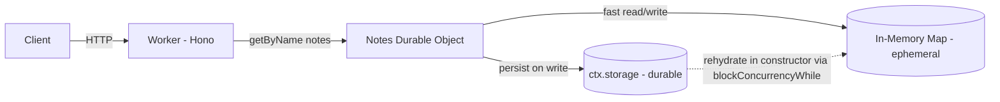

# Memory and Persist Durable Objects

Demonstrates how a Durable Object can hold ephemeral in-memory state for fast reads and rehydrate it from persistent storage when the DO restarts. Implemented as a small notes API.



## Why this pattern

A Durable Object's instance variables (in-memory state) live only as long as the DO is active. [When Cloudflare evicts or hibernates the DO, that memory is gone](https://developers.cloudflare.com/durable-objects/examples/durable-object-in-memory-state/#:~:text=After%20a%20brief%20period%20of,the%20object%20has%20been%20reinitialized.). `ctx.storage`, on the other hand, is durable — it survives evictions, restarts, and machine moves.

This pattern shows the canonical setup:

- **Memory as a fast read cache.** A `Map<string, Note>` lives on the DO instance — `list` / `get` read from it directly with no IO.
- **Storage as the source of truth.** Every mutation (`add`, `remove`, `clear`) writes through to `ctx.storage` so the data survives the next eviction.
- **Rehydrate on construction.** The constructor loads all persisted notes via `ctx.storage.list({ prefix: "note:" })` inside `ctx.blockConcurrencyWhile()`, which guarantees no requests are processed until in-memory state is restored.

It's useful any time you want sub-millisecond reads against state that must outlive a single DO lifetime: notes, session caches, leaderboards, agent memory, rate-limit state, presence tracking.

## Cloudflare primitives used

- Workers
- Durable Objects (SQLite-backed storage)

## Getting started

```bash
npm install
npm run cf-typegen
npm run dev
```

Then in another terminal:

```bash
# List notes
curl http://localhost:8787/notes

# Add a note
curl -X POST http://localhost:8787/notes \
  -H 'content-type: application/json' \
  -d '{"text":"hello world"}'

# Get a note by id
curl http://localhost:8787/notes/<id>

# Delete a note
curl -X DELETE http://localhost:8787/notes/<id>

# Clear all notes
curl -X DELETE http://localhost:8787/notes
```

To prove the persistence side: add a few notes, stop `wrangler dev`, restart it, then `GET /notes` again — the notes come back, loaded from storage into the in-memory `Map` during the constructor.

## Deploy

```bash
npm run deploy
```

## Further Reading

- [Durable Object in-memory state](https://developers.cloudflare.com/durable-objects/examples/durable-object-in-memory-state)
