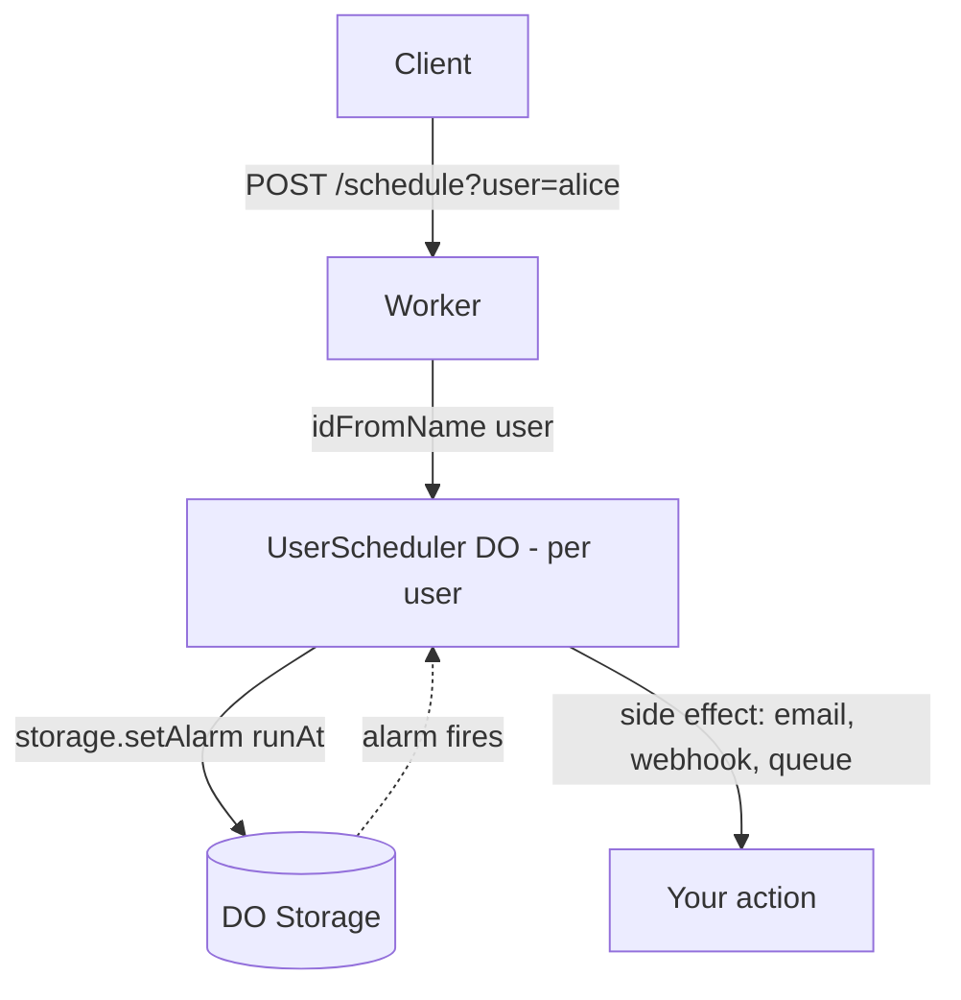

# Per User Cron

A Durable Object per user that fires an alarm at a user-specific time — useful for trial expirations, digest emails, subscription renewals, and reminders that don't fit a single global cron schedule.

## Why this pattern

Global Cron Triggers run on one schedule for your whole Worker. That's awkward when each user needs their own schedule — "remind this user 30 days after signup", "expire that trial at 11:43am Tuesday", "send the weekly digest at the user's preferred hour".

This pattern gives every user their own Durable Object, and each DO sets its own `alarm()`. Cloudflare wakes the DO at exactly that moment. No sweeping cron job scanning a database, no job queue table — the schedule lives next to the per-user state.

## Architecture



## Cloudflare primitives used

- Workers
- Durable Objects (SQLite-backed, with alarms)

## Try it

```bash
npm install
npm run dev
```

Schedule an alarm 10 seconds from now for user `alice`:

```bash
curl -X POST "http://localhost:8787/schedule?user=alice" \
	-H 'content-type: application/json' \
	-d "{\"runAt\": $(($(date +%s000) + 10000)), \"payload\": {\"email\": \"alice@example.com\"}}"
```

Check status:

```bash
curl "http://localhost:8787/status?user=alice"
```

Watch the `wrangler dev` logs — you'll see `[per-user-cron] fired for user=alice` after ~10s.

Cancel:

```bash
curl -X DELETE "http://localhost:8787/schedule?user=alice"
```

## Deploy

```bash
npm run deploy
```
