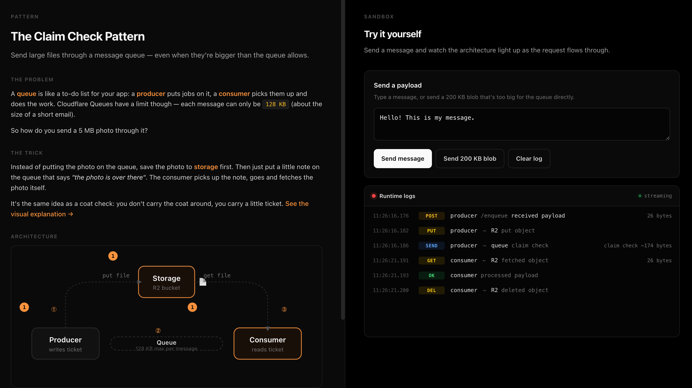
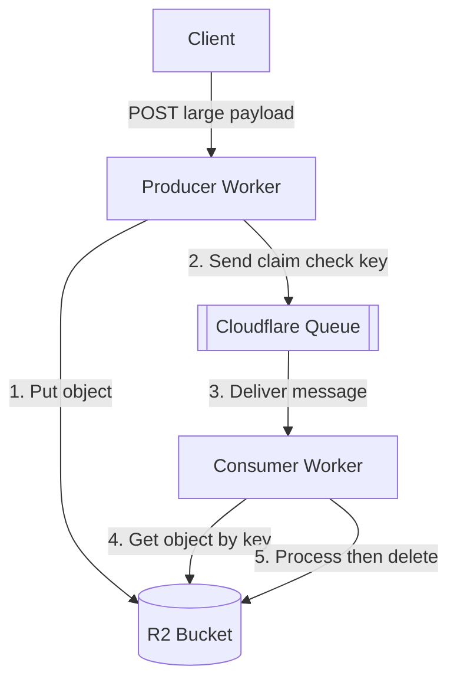

# Queue Claim Check



Send large payloads through Cloudflare Queues by stashing the body in R2 and passing only a reference [(claim check pattern)](https://eda-visuals.boyney.io/visuals/claim-check-pattern) — keeps messages under the 128 KB queue limit.

## Why this pattern

Cloudflare Queues caps messages at [128 KB (256 KB per batch)](https://developers.cloudflare.com/queues/platform/limits/). When you need to enqueue large payloads — uploaded files, ML inputs, bulk export rows, generated PDFs — you can't put the body on the queue. The claim check pattern writes the payload to R2, puts only the object key on the queue, and lets the consumer fetch and delete it after processing. Useful for async processing pipelines where payload size is unpredictable or occasionally exceeds the limit.

## Architecture



## Cloudflare primitives used

- Workers
- Queues
- R2

## Getting started

Install dependencies and generate runtime types from `wrangler.jsonc`:

```bash
npm install
npm run cf-typegen
```

Run the worker locally. Wrangler spins up a local R2 bucket and a local queue automatically — no Cloudflare account needed for dev:

```bash
npm run dev
```

Open [http://localhost:8787](http://localhost:8787) — there's a UI with two panels: a form for sending payloads, and a live event timeline showing each step of the pipeline (producer → R2 → queue → consumer). It polls `/events` once a second.

You can also drive it from the command line:

```bash
# small text payload
curl -X POST http://localhost:8787/enqueue --data "hello world"

# large binary payload (e.g. a 5 MB file) — would never fit in a 128 KB queue message directly
curl -X POST http://localhost:8787/enqueue \
  -H "content-type: application/octet-stream" \
  --data-binary @some-big-file.bin

# inspect the event log
curl http://localhost:8787/events | jq
```

## Deploy

Before deploying you need a real R2 bucket and queue (local dev creates them in `.wrangler/`, but production needs them provisioned):

```bash
npx wrangler r2 bucket create claim-check-payloads
npx wrangler queues create claim-check-jobs
npx wrangler queues create claim-check-jobs-dlq
npx wrangler kv namespace create claim-check-events
# → paste the returned id into wrangler.jsonc under kv_namespaces[0].id
npm run deploy
```

## Notes & tradeoffs

- **Queue message size cap:** 128 KB per message, 256 KB per batch. The claim check itself is tiny (~100 bytes), so you get effectively unlimited payload size bounded by R2's 5 TB object limit.
- **R2 lifecycle:** the consumer deletes the object after successful processing. If you prefer eventual cleanup, drop the `PAYLOADS.delete` call and add a [lifecycle rule](https://developers.cloudflare.com/r2/buckets/object-lifecycles/) expiring `inbox/` after N days.
- **Retries:** failed messages call `message.retry()` and get redelivered. After `max_retries` they land in the DLQ, but the R2 object is left in place so you can inspect it.
- **Missing objects:** if R2 returns null (e.g. manual deletion), the consumer acks and drops the message rather than retrying forever.
- **Extra round-trip:** producer does R2 put + queue send; consumer does R2 get + R2 delete. For payloads that comfortably fit in 128 KB, skip this pattern and put the body directly on the queue.
